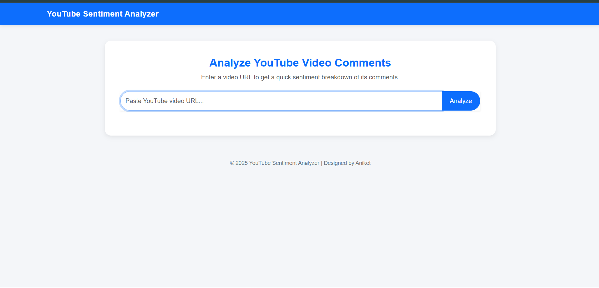
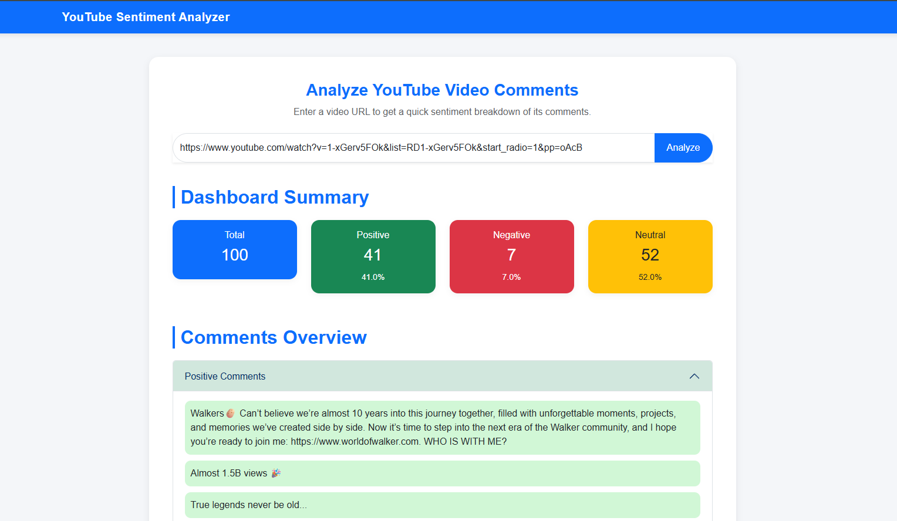

# YouTube Sentiment Analyzer

**YouTube Sentiment Analyzer** is a Python web app that lets users enter a YouTube video link and analyze the sentiment of its comments.  
It uses **Machine Learning / NLP** with a **transformer-based model** to classify comments as **positive, negative, or neutral**.  
Comments and their sentiment labels are also saved in a **CSV file** for further analysis.

## Screenshots

  

